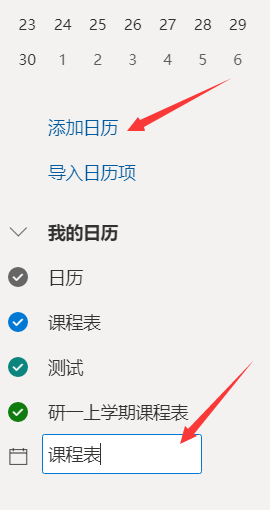
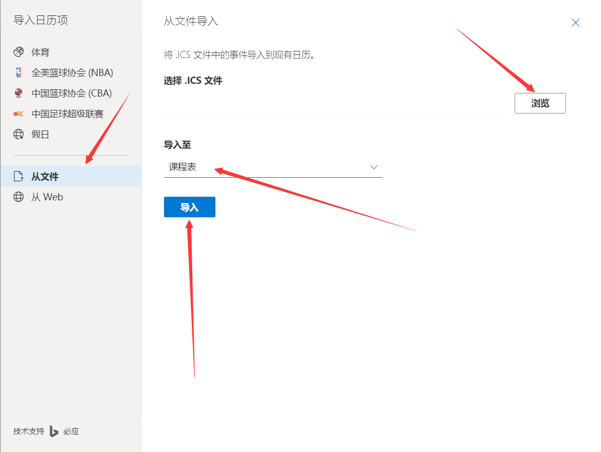
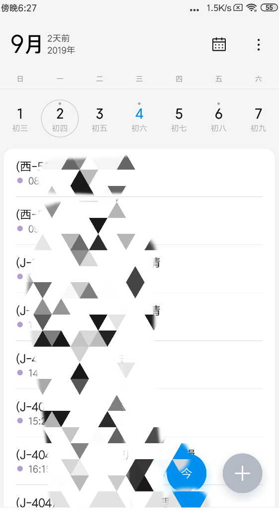
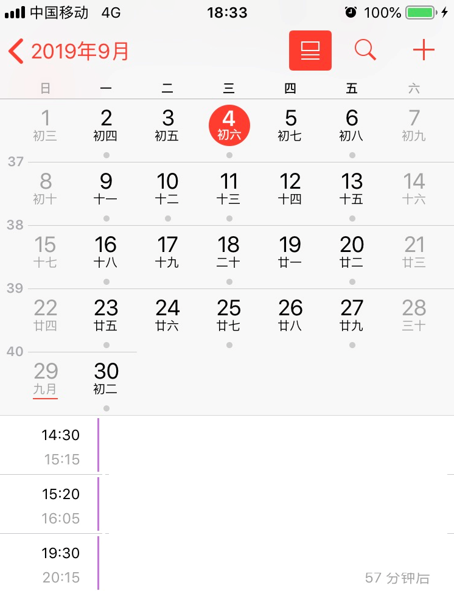

# 西电课程表爬取脚本

### 简介

本脚本通过模拟登录方式获取cookies，通过请求课程表数据的API获取课程表数据的JSON数据，解析获的JSON数据并生成 ICS（a filename extension for [iCalendar](https://en.wikipedia.org/wiki/ICalendar) files） 文件。在电脑端打开这个ICS文件即可将课程表导入到日历，再通过EXCHANGE服务多端同步，从而手机电脑都可以方便查看课表了。

### 背景

因为我电的课表实在让人凌乱，上课随周数而变化，有时候这周这门课没课，有时候那门课没课，实在让人琢磨不透，然后手机端也没有可以查看课表的APP，只能看截图，所以萌生了制作这个脚本的想法，花费了半天解析课程表，花费了一天模拟登陆，最后完成了这个脚本的初代！代码写的就跟那个啥一样=-=

### 脚本用法

新建一个文件夹存放本脚本

进入新创的这个文件夹

打开命令行（cmd），将命令行的路径调整到这个新建的文件夹，在命令行输入：

```shell
pip install requests
pip install beautifulsoup4
pip install ics
pip install cryptodemo
pip install cryptography

git clone https://github.com/cunzao/xidian-class-shedule.git
```

将代码Clone到本地，然后打开 **config.json** 文件，填写相应的数据！

```json
{
    "name" : "test", // 给生成的文件起名
    "stuNum" : "123456789", // 学号
    "passWord" : "12345678" // 密码
}
```

然后在窗口输入：

```shell
python index.py # python2
python3 index.py # python3
```

以上两个命令根据自己的环境输入。

然后你就在当前目录得到了两个文件："name".json 和 "name".ics（这两个文件名根据你填写的name不同而不同）

</br>

### ICS文件的使用

**错误使用**：~~在WINDOWS平台双击这个ICS文件，然后点击左上角的添加到日历~~。这样使用会导致你**很难删除**这些事件，**必须要一个一个点。必须要一个一个点。必须要一个一个点。**

**正确使用：** 使用微软的outlook，基本上每个人都有微软账号吧，就那个格式是XXXX@outlook.com的账号，然后在windows系统日历里找到设置，管理账号 - 添加账户 - outlook.com，然后输入账号密码登录。接着打开这个网页：[微软日历](https://calendar.live.com)，登录你的微软账号，再在左边找到 `添加日历`，点击`添加日历`，然后给这个日历取个名字，比如“课程表”，再然后找到`导入日历项`，点击`导入日历项`，从文件 - 浏览 - “name”.ics（就刚刚生成的那个ics文件）- 导入至 （选择你刚刚创建的那个日历，比如我刚刚取名的“课程表”）- 导入，现在就在日历生成了你的课程表了。你再打开电脑上的日历，然后发现电脑端的日历也有了这些课程。

图一、创建课程表



图二、导入ICS文件




### 课程表同步到Iphone

打开设置 - 密码与账户 - 添加账户 - outlook.com - 账户名 - 密码 - 登录 - 同意授权


### 课程表同步到小米手机

打开 日历 - 右上角的三个点 - 设置 - 日历账号管理 - 添加日历账号 - 公司 - outlook.com - 账户名 - 密码 - 登录 - 同意授权


### 效果

**小米手机**



**Iphone**




### 脚本文件介绍

总共有五个程序文件：

**index.py**

程序的入口类，用于调用整个程序，使程序运行

**CZuser.py**

包含一个czUser类，关于用户的账号操作都在里面，即登录

**CZHeaders.py**

发送数据请求的文件头都被包括在这个类中

**XIDIANClassShedule.py**

课程表类，包括以下功能：获取课程表信息、读取本地课程表信息、课程信息存储到本地、生成课程表的ICS文件

**myOneLesson.py**

将一节课封装成类，用于处理一节课的课程信息


### 最后

~~因为是初代版本~~，难免会有BUG，提ISSUE，PULL REQUEST都可以让我知道问题！祝一切顺利！


### 日志

2019年9月5日 17点11分

对整体程序进行重构


2020年10月26日 16点47分

1. 针对学校的密码加密，进行相应的加密

2. 针对本学期的时间调整相关的参数